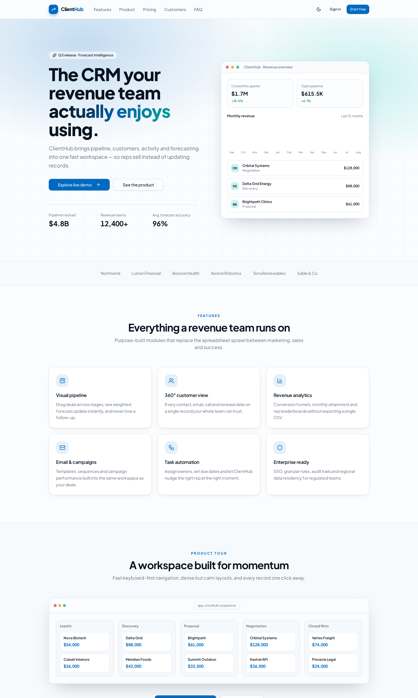
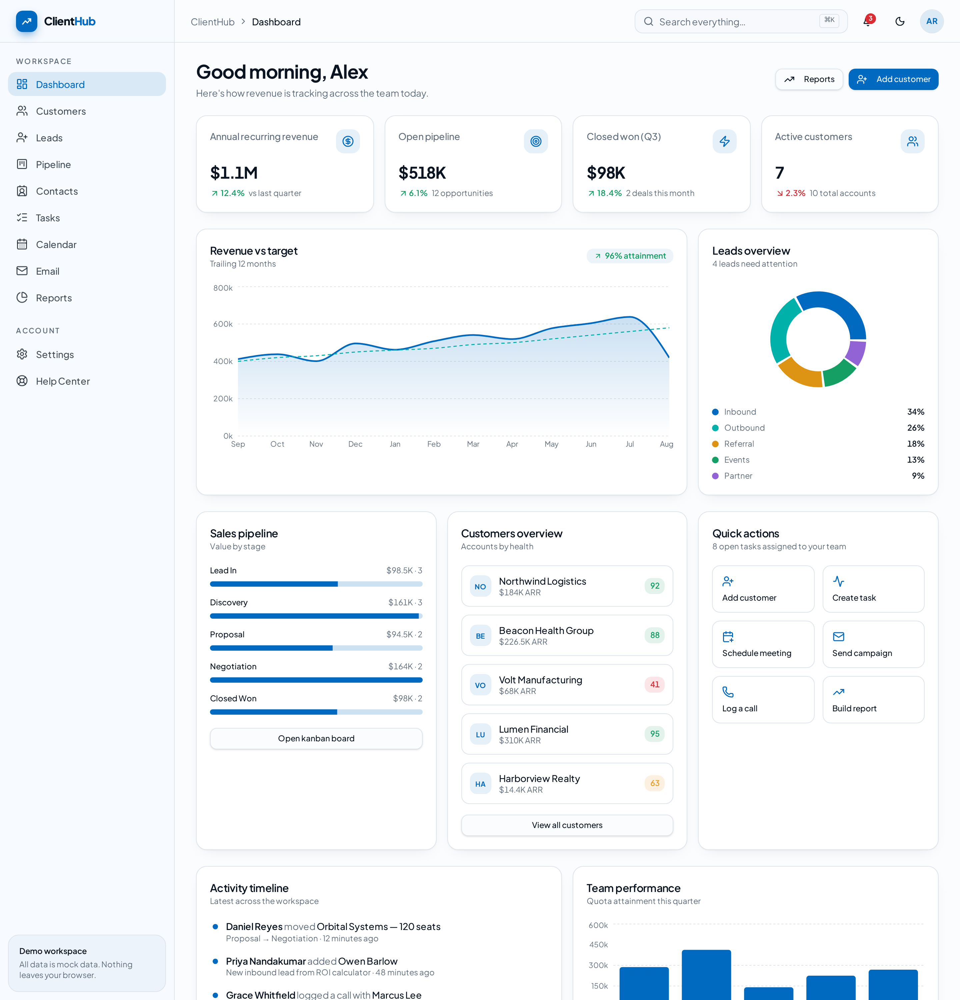
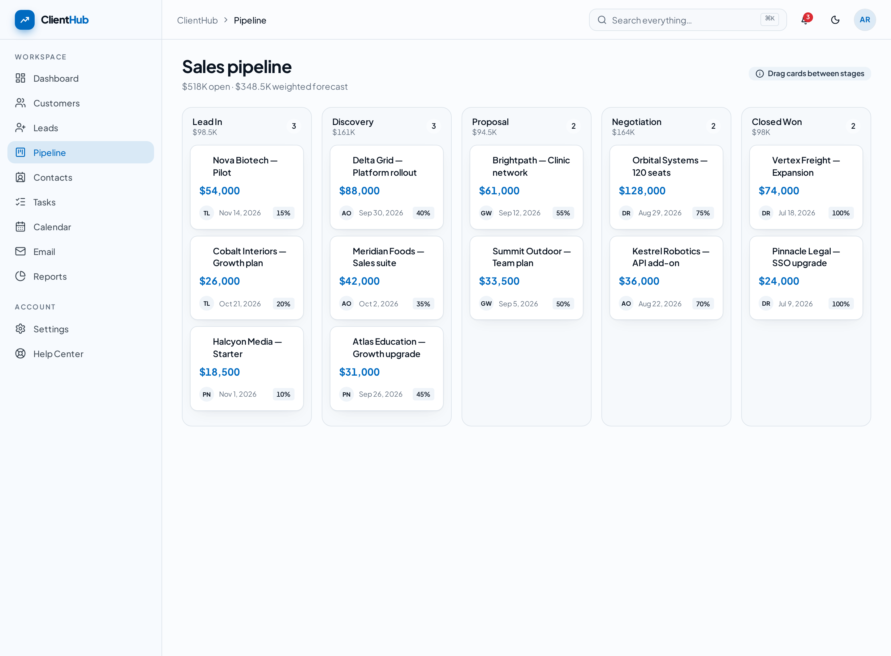
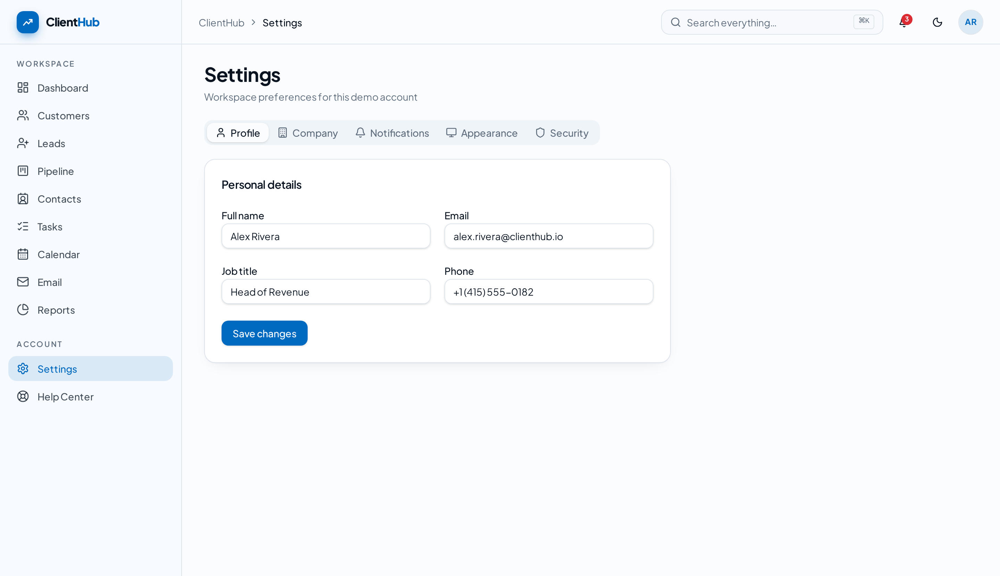
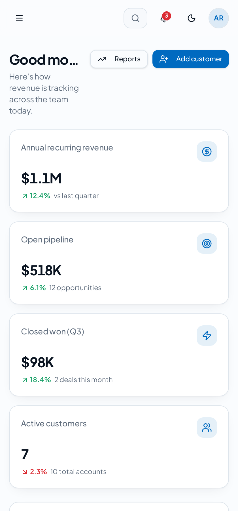

# ClientHub — Premium CRM Platform (Portfolio Demo)

ClientHub is a production-quality CRM interface built with TanStack Start, React, TypeScript and Tailwind CSS. It covers the full revenue workflow — landing page, demo auth, dashboard, customers, leads, a drag-and-drop sales pipeline, contacts, tasks, calendar, email, reports and settings — powered entirely by realistic mock data. No backend, no API keys, no external services.

## Screenshots

### Landing Page



_Marketing site with hero, social proof, feature grid and an interactive product tour._

### Dashboard



_Revenue KPIs, revenue-vs-target chart, leads breakdown, activity timeline and team performance._

### Main Feature — Sales Pipeline Board



_Drag-and-drop kanban board with per-stage totals and a weighted forecast that updates instantly._

### Settings



_Profile, company, notifications, appearance (light/dark) and security preferences._

### Mobile View



_Fully responsive layout with a collapsible sidebar and stacked KPI cards._

## Features

- **Dashboard** — revenue cards, leads and customers overview, pipeline summary, activity timeline, team performance, quick actions
- **Customers** — list, detail profile, create, edit and delete
- **Leads** — status tracking, rep assignment, notes, search and filters
- **Sales pipeline** — kanban stages with drag-and-drop opportunity cards
- **Contacts** — directory with communication history
- **Tasks** — assignment, due dates, priorities and status
- **Calendar** — meetings, calls, follow-ups and upcoming events
- **Email** — inbox preview, sent items, templates and campaign dashboard
- **Reports** — sales charts, revenue analytics, conversion rate, monthly performance
- **Settings** — profile, company, notifications, appearance, security
- **Extras** — global ⌘K search, notifications, loading skeletons, empty states, 404 page, Help Center
- **Design** — light/dark mode, smooth animations, responsive premium UI

## Tech Stack

- [TanStack Start](https://tanstack.com/start) + TanStack Router (file-based routing)
- React 19 + TypeScript
- Tailwind CSS v4 with an OKLCH design-token system
- shadcn/ui primitives, lucide-react icons, Recharts, Sonner

## Getting Started

```sh
git clone https://github.com/<your-username>/clienthub-crm.git
cd clienthub-crm
npm install
npm run dev
```

The app runs at `http://localhost:8080`. Sign in with any email and password — authentication is simulated in the browser.

## Project Structure

```
src/
├─ components/   reusable UI, app shell, forms
├─ lib/          mock data, CRM store, auth + theme providers
├─ routes/       file-based routes (marketing, auth, /app modules)
└─ styles.css    design tokens and theme
screenshots/     README screenshots
```

## Data & Privacy

All records are fictional mock data held in browser memory. Nothing is persisted to a server and no credentials or API keys are required.

## License

Released under the [MIT License](./LICENSE).
